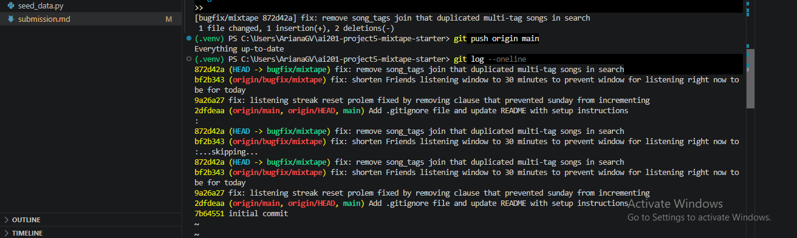

**🤖 AI Usage**

- **Navigation — mapping the app before touching any bug.** Before starting, I asked the AI to trace how a feature flows through the codebase ("how does adding a song to a playlist end up notifying someone?"). It walked the `POST /playlists/<id>/songs` route → `notification_service.add_to_playlist()` → `create_notification()` chain and pointed out the routes → services → models layering. That gave me the mental model I used to write the Codebase Map and to know that "the bug is in an endpoint" always means "trace it back to the service."

- **Debugging — localizing a failure to a specific line.** For the "Friends Listening Now shows yesterday" issue, I asked the AI where the recency window was defined. Instead of guessing, it had me confirm the query filter was correct (`listened_at >= now - RECENT_THRESHOLD`) and follow `RECENT_THRESHOLD` up to the module-level constant, which turned out to be `timedelta(hours=24)`. That narrowed a vague "feed is wrong" report to a one-line constant change. I did the same for `get_playlist_songs()`, where the AI flagged the trailing `[:-1]` slice as the reason the last song disappeared.

- **Honest collaboration — where I had to course-correct the AI.** Two moments stand out. (1) Early on, the AI reported that the three fixes "looked complete." I didn't take that at face value and ran `pytest tests/` myself — it surfaced **two failing playlist tests** the AI's read-through had glossed over, which is how the `[:-1]` bug got found. (2) The AI initially mislabeled that playlist bug as "Issue #4." I checked the README's issue tracker and found the real Issue #4 was a *different* bug — `rate_song()` never sends a notification — and that the playlist slice was actually Issue #5. I had the AI re-align the numbering to the tracker, then I verified the rating fix independently by running a scratch scenario (friend rates a song → sharer gets exactly one notification; self-rating → none) rather than trusting the explanation of the fix.

- **What I verified vs. what the AI produced.** The AI drafted explanations; I confirmed each one by running the test suite (13 passing) and, for the two bugs with no test coverage (the feed window and the rating notification), by building small reproduction scenarios by hand and reading the resulting rows. 

# Mixtape — Codebase Map

Mixtape is a Flask + SQLAlchemy JSON API for a social music-sharing app. Users share
songs, add them to collaborative playlists, rate them, listen to them (building daily
streaks), and see what their friends are playing in a feed.

## Main files and their responsibilities

### `app.py` — application factory + DB handle
Defines the shared `db = SQLAlchemy()` instance and the `create_app(config=None)` factory.
The factory sets config (SQLite `mixtape.db` by default, overridable via `DATABASE_URL`),
calls `db.init_app(app)`, registers the four blueprints under URL prefixes
(`/songs`, `/playlists`, `/users`, `/feed`), and runs `db.create_all()`. Because `db`
lives here and the models import it, the app **must** be started through the factory
(`FLASK_APP=app:create_app flask run`) — importing `app.py` as a script double-registers
the models and triggers a SQLAlchemy error.

### `models.py` — the data layer
Seven entities plus three association tables, all keyed by string UUIDs:

- **`User`** — username, email, `listening_streak`, `last_listened_at`. Has relationships
  to shared songs, ratings, listening events, notifications, playlists, and a self-
  referential many-to-many `friends` (via the `friendships` table, stored bidirectionally).
- **`Song`** — title, artist, album, genre, `shared_by` (FK to the sharer), `share_note`.
  Related to ratings, listening events, and tags.
- **`Tag`** — a name; linked to songs via the `song_tags` join table.
- **`ListeningEvent`** — a `(user_id, song_id, listened_at)` row. This is the raw material
  the feed is computed from.
- **`Rating`** — a `(user_id, song_id, score 1–5)` row with a unique constraint on
  `(user_id, song_id)`, so a user has at most one rating per song. Ratings are their own
  model, **not** a column on `Song`.
- **`Playlist`** — name, `created_by`, `is_collaborative`. Songs are attached via the
  **`playlist_entries`** join table, which carries an explicit `position` column plus
  `added_by` and `added_at` — so playlist membership records ordering and provenance, not
  just insertion.
- **`Notification`** — `user_id` (recipient), `notification_type`, `body`, `read` flag.

Association tables: `friendships`, `song_tags`, and `playlist_entries` (the last is the
richest — it's an ordered, attributed join table).

### `routes/` — thin HTTP layer (blueprints)
Each blueprint parses input, calls one service function, and formats the JSON response.
Errors surface as `ValueError` from the service and are translated to 400/404.

- **`routes/songs.py`** — `GET /songs/search?q=`, `GET /songs/<id>`,
  `POST /songs/<id>/rate`, `POST /songs/<id>/listen`.
- **`routes/playlists.py`** — `POST /playlists/`, `GET /playlists/<id>`,
  `GET /playlists/<id>/songs`, `POST /playlists/<id>/songs` (add a song).
- **`routes/users.py`** — `GET /users/<id>`, `GET /users/<id>/streak`,
  `GET /users/<id>/notifications`, `POST /users/notifications/<id>/read`.
- **`routes/feed.py`** — `GET /feed/<id>/listening-now`, `GET /feed/<id>/activity`.
- **`routes/__init__.py`** — empty package marker.

### `services/` — business logic
- **`feed_service.py`** — `get_friends_listening_now(user_id)` (each friend's single most
  recent song within the last 24h, deduped) and `get_activity_feed(user_id, limit=20)`
  (most recent N friend events, no recency cutoff, not deduped).
- **`streak_service.py`** — `record_listening_event()` (writes a `ListeningEvent` and
  updates the streak), `update_listening_streak()` (the +1 / reset rules), `get_streak()`.
- **`notification_service.py`** — `create_notification()`, `add_to_playlist()` (adds a song
  to a playlist and notifies the sharer), `rate_song()` (upsert a rating),
  `get_notifications()`, `mark_as_read()`.
- **`playlist_service.py`** — `create_playlist()`, `get_playlist_songs()` (ordered by
  `position`), `get_playlist()`, `get_user_playlists()`.
- **`search_service.py`** — `search_songs()` (case-insensitive title/artist match with
  tags) and `get_song()`.

### `seed_data.py` — test fixtures
Drops and recreates all tables, then seeds 5 users with friendships, 10 tags, songs with
0 / 1 / 3+ tags, recent and older listening events, streak state, three playlists, and a
sample notification. Run with `python seed_data.py`.

### `tests/`
`test_playlists.py`, `test_search.py`, `test_streaks.py` exercise the corresponding
service behavior.

## Data flow — adding a song to a playlist triggers a notification

This is the app's real notification path. Say **darius** adds one of **nova's** shared
songs to nova's playlist.

1. **`POST /playlists/<playlist_id>/songs`** with `{"song_id": ..., "added_by": <darius>}`
   hits `add_song()` in [routes/playlists.py](routes/playlists.py#L43). The route validates
   that `song_id` and `added_by` are present, then delegates.
2. **`notification_service.add_to_playlist(playlist_id, song_id, added_by)`**
   ([services/notification_service.py](services/notification_service.py#L35)):
   1. Loads the `Song`, the adder (`User`), and the `Playlist`, raising `ValueError` if any
      is missing.
   2. Appends the song to `playlist.songs` (if not already present) and commits — this
      inserts a `playlist_entries` row.
   3. Compares `song.shared_by` to `added_by`. If they differ, it calls
      **`create_notification(user_id=song.shared_by, type="song_added_to_playlist", body=...)`**
      — so the notification goes to the song's **original sharer** (nova), not the adder.
3. **`create_notification()`** inserts a `Notification` row and commits.
4. The route returns `{"message": "Song added to playlist"}` with `201`.
5. Later, nova calls **`GET /users/<nova>/notifications`** → `get_notifications()` reads the
   `Notification` rows back, newest first.

A second real flow — **listening builds the feed**: `POST /songs/<id>/listen` →
`streak_service.record_listening_event()` writes a `ListeningEvent` and bumps the streak;
a friend then sees that song via `GET /feed/<id>/listening-now` →
`feed_service.get_friends_listening_now()`, which reads recent `ListeningEvent` rows for the
viewer's friends. There is no stored "feed" table — the feed is computed on read.

## Patterns in how the app is organized

- **Strict layering: routes → services → models.** Every route immediately delegates to a
  service function. Routes only parse request input and format JSON responses; all business
  logic and DB access lives in `services/`. Routes never query models directly (the one
  small exception is `users.py`, which does a trivial `db.session.get(User, ...)` lookup).
- **`ValueError` as the cross-layer error contract.** Services raise `ValueError("… not
  found")` for missing entities; every route wraps its service call in `try/except
  ValueError` and maps it to a 404 (or 400 on writes). No custom exception types.
- **Notifications are a side effect, not a resource you create directly.** There's no
  "create notification" endpoint. They're produced internally by `add_to_playlist` when one
  user acts on another user's song.
- **Derived-on-read feeds.** The feed isn't materialized; it's queried live from
  `ListeningEvent`, with the two endpoints differing only in filtering (24h + dedup vs.
  most-recent-N).
- **UUID string PKs and `to_dict()` everywhere.** Every model generates a UUID primary key
  and exposes a `to_dict()` used for JSON serialization, keeping response shaping in the
  model rather than the route.
- **Application-factory + blueprint modularity.** `create_app()` plus one blueprint and one
  service module per domain (songs, playlists, users, feed) makes the feature boundaries
  explicit and testable.

**📋 Root Cause Analysis**

**Issue #1 — My listening streak keeps resetting**

- *How I reproduced it* — Ran `pytest tests/test_streaks.py -v`. `test_streak_increments_on_sunday` failed with `assert 1 == 2`: recording a listen on Saturday and then Sunday reset the streak to 1 instead of incrementing to 2. The other four streak tests passed, which localized the bug to the Saturday→Sunday transition specifically rather than the streak logic in general.
- *How I found the root cause* — The failing test only exercises `update_listening_streak()`, so I opened `services/streak_service.py` and read that function's day-comparison branches. The tell was the consecutive-day branch: `elif days_since_last == 1 and today.weekday() != 6:`. The `and today.weekday() != 6` clause maps to no rule in the docstring, and `weekday() == 6` is precisely Sunday — the exact day the failing test lands on.
- *What the root cause is* — The "consecutive day" increment branch carried an extra condition, `today.weekday() != 6`. Python's `weekday()` returns 6 for Sunday, so whenever the current listen fell on a Sunday, that condition was false even though exactly one day had passed. Execution dropped to the `else` branch, which resets the streak to 1. So any streak that crossed into Sunday was wrongly reset instead of extended.
- *Fix and side-effect check* — Removed the `and today.weekday() != 6` clause so a one-day gap increments on every weekday ([streak_service.py:73](services/streak_service.py#L73)). Re-ran the full streak suite: all 5 pass, including "no double-count on the same day" and "reset after a skipped day," confirming the increment/reset rules still behave correctly for the non-Sunday cases.

**Issue #2 — Friends Listening Now shows people from yesterday**

- *How I reproduced it* — There are no automated feed tests, so I reproduced it against the data contract in `seed_data.py` (recent events 10–20 min ago should appear; older events 2h+ should not). I built an in-memory scenario with one friend who listened 15 minutes ago and one who listened 20 hours ago, then called `get_friends_listening_now()`. The 20-hour-old friend came back in the result, confirming stale "yesterday" entries leak into the feed.
- *How I found the root cause* — Opened `services/feed_service.py` and read `get_friends_listening_now()`. The query itself was correct — it filters `listened_at >= now - RECENT_THRESHOLD` and orders/dedupes properly. That pointed away from the logic and toward the window value, so I followed `RECENT_THRESHOLD` to the module-level constant.
- *What the root cause is* — `RECENT_THRESHOLD` was set to `timedelta(hours=24)`. "Listening now" therefore matched anyone who had listened at any point in the previous 24 hours — i.e. all of yesterday — rather than people who are actively listening right now. The filtering code was right; the recency window was simply far too wide.
- *Fix and side-effect check* — Changed `RECENT_THRESHOLD` to `timedelta(minutes=30)`, the window documented in `seed_data.py` ([feed_service.py:13](services/feed_service.py#L13)). Re-ran my scenario: the 15-minute friend appears, the 20-hour friend is excluded. Checked the sibling function `get_activity_feed()` — it doesn't use this constant (it's limited by count, not recency), so it is unaffected by the change.

**Issue #3 — The same song keeps showing up twice in search**

- *How I reproduced it* — The search unit tests passed, so the bug wasn't visible through them. I reproduced it at the query level: seeded one song with 3 tags and ran the query two ways. `db.session.query(Song)...all()` returned 1 row, but the equivalent `select(Song)...scalars().all()` returned 3 — proving the join expands a 3-tag song into 3 rows and that only the ORM was hiding it.
- *How I found the root cause* — Opened `services/search_service.py` → `search_songs()` and saw the `.outerjoin(song_tags, Song.id == song_tags.c.song_id)`. Joining a one-to-many relationship (song → many tags) is the classic cause of duplicated parent rows, and the function never actually reads any tag column — it only filters on title/artist — so the join had no functional purpose. The 1-vs-3 row experiment confirmed the join was the source.
- *What the root cause is* — The query joined the `song_tags` association table but selected only `Song`. Because a song has one row per tag in `song_tags`, each matching song was emitted once per tag, so a song with N tags appeared N times. It looked fine in the tests only because SQLAlchemy's legacy `Query.all()` silently de-duplicates entities by primary key — a fragile mask that would disappear the moment the query were rewritten in the modern `select()` style.
- *Fix and side-effect check* — Removed the `.outerjoin(song_tags, ...)` and the now-unused `Tag`/`song_tags` imports ([search_service.py](services/search_service.py)). The query now returns exactly one row per matching song without relying on ORM de-duplication. Re-ran all 5 search tests (pass) and re-ran the 3-tag experiment: `search_songs` now returns 1 row, and the result still includes all three tags — because `Song.to_dict()` loads tags through the relationship, so removing the join didn't drop any tag data.

**Issue #4 — I get notified when a friend adds my song to a playlist, but not when they rate it**

- *How I reproduced it* — There are no automated tests for the notification service, so I reproduced it in a scratch app context. I created a sharer (nova) and a friend (darius), had nova share a song, then called `rate_song(darius, song, 4)` and read `get_notifications(nova)`. Nova received **zero** notifications — confirming the rating path is silent — even though the playlist-add path for the same sharer produces one. The bug report's framing ("added → notified, rated → not") pointed me straight at comparing those two code paths.
- *How I found the root cause* — Both behaviors live in `services/notification_service.py`, so I read `add_to_playlist()` and `rate_song()` side by side. `add_to_playlist()` ends with a guarded `create_notification(user_id=song.shared_by, …)` call; `rate_song()` ends at `db.session.commit(); return rating` — it saves the `Rating` but never calls `create_notification()` at all. The two functions were structurally parallel right up to the notification step, where `rate_song()` simply stopped. That asymmetry was the moment I was sure: the rating logic was complete, but the *notify-the-sharer* side effect was missing entirely.
- *What the root cause is* — `rate_song()` performs the rating upsert and commits, but omits the notification side effect. The reported behavior isn't caused by a wrong condition or comparison — it's a missing step: the function never tells the song's sharer that their song was rated. The playlist flow got the side effect; the rating flow was never wired up to it. Correct behavior requires more than persisting the rating — a rating is a social event, so the sharer must be notified, exactly as they are on a playlist add.
- *Fix and side-effect check* — After the commit, added a guarded `create_notification(user_id=song.shared_by, notification_type="song_rated", body=…)` call, mirroring `add_to_playlist()`'s pattern including the `song.shared_by != user_id` guard so rating your **own** song notifies nobody ([notification_service.py:112](services/notification_service.py#L112)). Verified three paths: (1) a friend rating nova's song creates exactly one `song_rated` notification with the correct body; (2) nova rating her own song creates none (the self-rating guard holds); (3) the rater themself receives nothing. Also re-ran the full suite (13 pass) — the rating upsert itself (create vs. update, the 1–5 score validation) was untouched, so existing rating behavior is preserved and only the notification was added.

**Issue #5 — The last song in a playlist never shows up**

- *How I reproduced it* — Ran `pytest tests/test_playlists.py -v`. Two tests failed: `test_playlist_returns_all_songs` (asserted 5, got 4) and `test_playlist_returns_songs_in_order` (expected `["Track 1"…"Track 5"]`, got only through `Track 4`). Both used the same fixture — a playlist seeded with 5 songs at positions 1–5 — and both lost exactly the final, highest-position entry. The empty-playlist test still passed, so the bug only bites when the playlist is non-empty.
- *How I found the root cause* — The failures were in `get_playlist_songs()`, so I opened `services/playlist_service.py` and read that function top to bottom. The query was correct: it joins `playlist_entries`, filters by `playlist_id`, and orders by `asc(position)` — the ordered test proved the rows come back in the right order, so nothing was being *mis-sorted*. That narrowed the loss to something after the query. The last line was the tell: `return [song.to_dict() for song in songs[:-1]]`. The `[:-1]` slice is applied *after* the ascending sort, so it always discards the highest-position song.
- *What the root cause is* — The list comprehension iterated over `songs[:-1]` instead of `songs`. Python's `[:-1]` slice returns every element except the last, so `get_playlist_songs()` truncated one song off the end of every non-empty playlist. Because the rows were sorted ascending by `position`, the dropped element was always the *last-added* song — which is why the two order-sensitive tests lost `Track 5` specifically. An empty playlist was unaffected because `[][:-1]` is still `[]`.
- *Fix and side-effect check* — Changed `songs[:-1]` to `songs` so the comprehension returns every row the query produced ([playlist_service.py:66](services/playlist_service.py#L66)). Re-ran the full suite: all 13 tests pass, including the empty-playlist case (confirming the fix didn't turn `[]` into an error) and the ordering test (confirming Track 5 now appears in the correct final position). I also checked `add_song()`/`add_to_playlist()` in `notification_service.py`, which is what writes `playlist_entries` rows — it was never involved; the songs were being inserted correctly all along and only the read path was dropping one.

